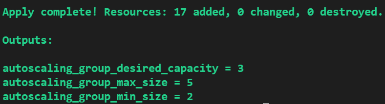

### HCL and Terraform to create VPC with 4 subnets
- One VPC is created with: `./vpc`
    - 3 subnets with Internet gateway and public access.
    - 3 subnets as private and without public IP.
- Austo scalling group is also added in this VPC with: `./asg`.
    - 3 desired EC2 instances
    - 2 minimum instances
    - and 5 Maximum instances
- One ELB is also created which listens to HTTPS port  `./elb`.
- ssl certification is also needed for ELB which listens to HTTPS port `./cert`.
- The number of max, min and desired instances for ASG can be seen at the end of the run as:

- In order to change the number of desired, min and maximum number of instances for ASG change the values in `variable.tf`.

- UserData is used to install and rund Docker with nginx image in `./asg` line 34.

## Note:
- for security concerns and secure practice is to avoid copying the public and private keys into the repo. Use different methods such as Ansible or vault instead.
